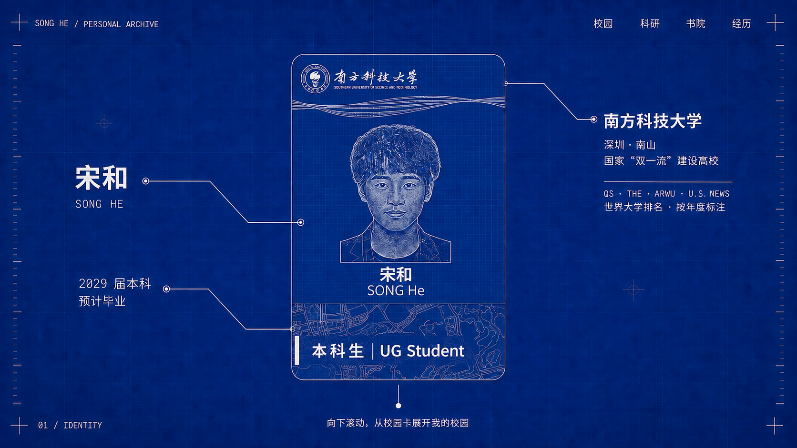
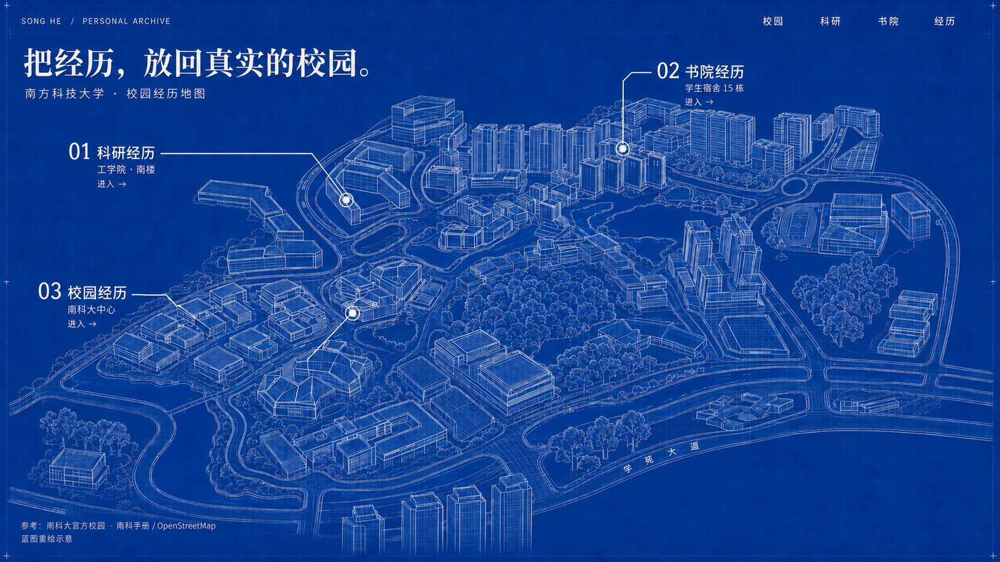

# 蓝图校园简历 · 第二版示意

本版以用户提供的真实竖版校园卡照片为结构依据，并先检索南科大官方校图、真实航拍与校园导航资料，再生成视觉示意。使用内置 imagegen；当前仍是图像方案，不是已实现网页或测绘模型。

## 最新确认的卡片要求

- 整张卡也采用蓝图形式：钴蓝底，白色轮廓、文字和点阵。
- 保留真实卡片的竖版比例、校徽校名布局、上方曲线装饰、头像位置及中英文姓名。
- 将用户照片转成同一人物的白色点阵/轮廓头像。
- 隐去 SID 与二维码，不复制到交付图中。
- 下方原花纹换成依据真实导航图重绘的校园平面图。
- 底部身份行保留完整“本科生 | UG Student”及原行的中英文样式，放在底部区域的垂直中间，靠左对齐。

## 校园资料与使用方式

| 资料 | 来源与版本 | 本轮用途 |
| --- | --- | --- |
| 学校官方校园地图 | [官网地图页面](https://www.sustech.edu.cn/zh/contact_us.html)，[地图原图](https://www.sustech.edu.cn/uploads/images/2024/05/10103209_79587.jpg)，资源目录为2024年5月 | 对照真实建筑组团、校园整体相对布局和斜俯视形态。 |
| 真实校园航拍 | [总务部门原图](https://gao.sustech.edu.cn/uploads/202009/24153737_54741.jpg)，资源目录为2020年9月 | 参考真实建筑体量和山地校园形态；图中有在建区域，不作为2026年的竣工状态。 |
| 新版校内导航图 | [南科手册交通页](https://sustech.online/transport/)，v5.0，图内标注2025-11-24生效 | 校对楼号、工学院南北楼、15栋、道路与水体。公开PDF已保存并渲染。 |
| 导航点位数据 | [公开建筑 GeoJSON](https://bus.sustcra.com/geojson/sustech_bldg.json)，76个设施/建筑点，源数据未注明修订时间 | 确认15栋和南科大中心的点位；不是建筑轮廓或楼高数据。 |
| 学生事务中心办公地点 | [学校学工部联系页](https://osa.sustech.edu.cn/about/contact/) | 现行页面列南科大中心208，因此校园经历入口以“南科大中心”作为建筑标签。 |

工学院南楼按公开地图定位；上述建筑点位集没有工学院条目，不使用校巴站点替代建筑中心。15栋位于二期宿舍东部，邻14栋与16栋。南科大中心位于湖畔宿舍以南、主教学区以北。

可复用数据保存于 references/sustech-buildings.geojson 与 references/verified-navigation-anchors.geojson；详细查证见 references/navigation-verification.md。

## 图像说明

卡片图将真实卡片布局转成蓝图语言；校园图受公开地图和航拍约束重绘。建筑细部及投影仍属于生成式示意，不应当成可用于实际寻路的精确地图。后续制作交互模型时，用地图锚点和实际建筑照片继续校准几何。

地图参考署名：南方科技大学官方校园图、南科手册 sustech.online、交通协会 SUSTransit、南科大总务后勤部、OpenStreetMap contributors。南科手册注明其未单独声明的内容采用 [CC-BY-SA 4.0](https://creativecommons.org/licenses/by-sa/4.0/)；本版对地图部分做蓝图式简化与重绘，公开分享该演绎地图时保留来源及相同许可。

生成过程和最终提示词见 prompts.json。原始校园卡照片仅作为输入引用，未复制到此交付目录。

