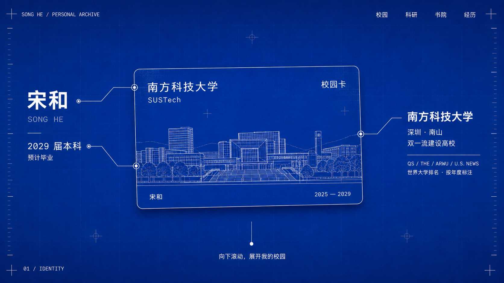
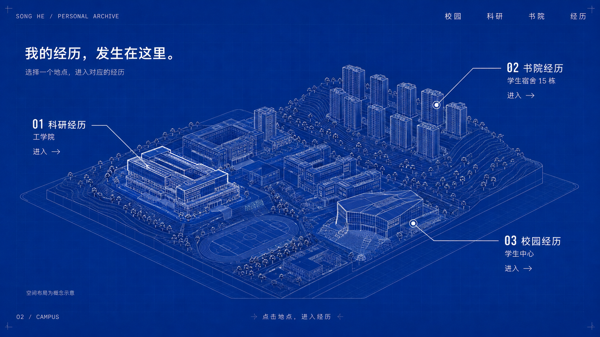
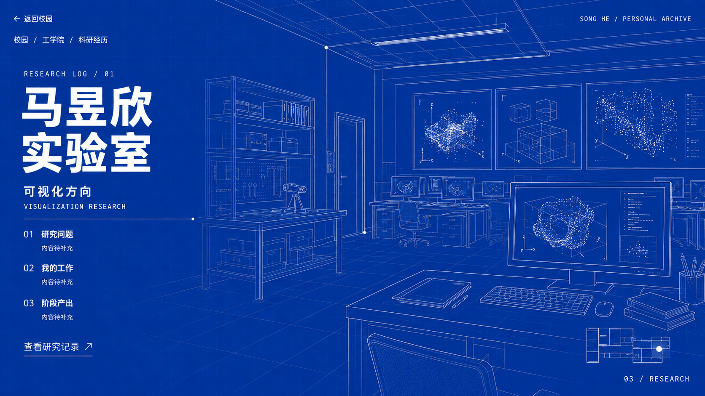

# 宋和个人简历 · 蓝图校园方案

方案日期：2026-09-06。交付范围为视觉概念、叙事与交互设计，现有网站页面未修改。

## 核心概念

把一张校园卡展开为一份可以探索的个人档案。访问者先认识宋和，再看到经历发生的地点，最后进入对应空间阅读具体工作。视觉由钴蓝底色、白色节点、建筑细线和粗体日志标题构成。

主路径：校园卡 → 滚动展开校园 → 选择建筑 → 运镜进入经历 → 返回校园或切换经历。

## 01 / 校园卡首屏

- 中间：横向校园卡，宽约屏幕的 42%–48%。卡面保留南科大名称、个人姓名和校园二维线稿，悬浮角度控制在很小范围。
- 左侧：两个圆点锚定姓名和年份，用细折线引出“宋和 / SONG HE”和“2029 届本科 / 预计毕业”。2029 年尚未到来，避免写成已毕业。
- 右侧：校园建筑线稿上的圆点引出“南方科技大学”，下方为“深圳 · 南山 / 国家‘双一流’建设高校”。
- 排名：放在学校信息下方，以四行微型档案字段展示，每项带榜单名称、年份和世界排名；权重低于姓名和学校。
- 底部：一条短竖线和圆点，提示“向下滚动，展开我的校园”。
- 顶部保留轻量文字导航，正式版本加入“作品”和“简历”入口，使既有 EchoNote Lecture、Liquid Deadline、Hard Nest 案例可以直接到达。

校园卡首屏必须在三维模型加载完成前可读、可操作。现有项目的卡片是网页绘制的身份卡，不能把它当作已经取得的真实校园卡图样。

## 02 / 校园从卡面展开

建议用约 1.5–2 个屏高的滚动距离完成转场。以下百分比描述这个转场自身的进度，均为待原型验证的设计值。

| 进度 | 画面与动作 |
| --- | --- |
| 0–20% | 两侧说明收拢淡出，卡片移向画面中心并放大；校园线稿始终保持可辨认。 |
| 20–45% | 卡面向后倾斜，线稿过渡为校园地面；卡片边框继续充当地面边界。 |
| 45–80% | 建筑轮廓逐渐升起，逐层增加高度与侧立面，地形和道路展开。 |
| 80–100% | 镜头停在约 35–45° 的校园斜俯视角；三个经历节点与标签出现。 |

核心要求是连续性：二维线稿与三维模型需要共享建筑锚点。正式制作先根据校图建立简化模型，再设计与其匹配的二维卡面线稿；如果采用真实校园卡上不同视角的图案，需要另做线稿匹配，不能直接把一张位图自动变成准确校园模型。

三维模型采用白色主要轮廓线、少量白色节点及蓝色遮挡面。隐藏不必要的背面边线，保证建筑体积可读。周围建筑简化，三个目标建筑增加辨识细节。

| 建筑入口 | 页面内容 | 点击后的镜头 |
| --- | --- | --- |
| 工学院 | 科研经历 | 朝目标建筑缓慢下降推进，经过立面或入口，进入实验室场景。 |
| 学生宿舍 15 栋 | 书院经历 | 镜头靠近入口或公共空间，呈现书院活动与个人工作记录。 |
| 学生中心 | 校园经历 | 镜头进入活动空间，呈现学生会、提案、校园服务等经历。 |

标记使用圆点、外圈和细引线；标签直接写经历类型与建筑名称，不要求访客记住编号。悬停时目标轮廓变亮、引线增强；整个文字标签也可点击。

## 03 / 点击、运镜与返回

一次进入动作建议约 1.4–1.8 秒：先确认选中目标，再推进，最后镜头稳定后显示正文。避免连续大角度旋转。访问者可跳过运镜。

校园总览由滚动控制展开；进入经历后，滚动用于阅读正文。不要让一次滚轮动作同时推动镜头和正文。

左上角始终提供“返回校园”；返回时恢复之前的视角与选中位置。另提供“科研 / 书院 / 校园”文字入口与可直接分享的经历地址。浏览器返回、键盘操作与移动端点击应到达相同内容。

## 04 / 马昱欣实验室：科研日志

画面左侧为稳定可读的文字，右侧为蓝图式实验室空间：桌面、显示器、点云、抽象可视化线条。进入动作结束后背景保持稳定。

建议标题排版：

> RESEARCH LOG / 01  
> **马昱欣实验室**  
> 可视化方向  
> 数据可视化 · 可视分析 · 可解释人工智能

这三个研究方向来自学校教师官网，不等同于宋和已参与的个人研究内容。正式经历正文以用户实际提供的项目资料为准。

正文顺序为“研究问题 → 我的工作 → 阶段产出”，每条经历补充时间、个人角色、具体行动及可公开的证据。现有页面中未找到足够的实验室经历细节，示意图以“内容待补充”占位。

“宇航员日志感”通过字体、编号、日期字段、细分隔线和空间纵深表达。中文标题用粗黑体，英文小标与编号用等宽字体；正文使用普通清晰的中文无衬线字体。长正文一次呈现，不逐字打字。

## 05 / 另外两个场景

- 书院经历：宿舍 15 栋附近的公共空间或活动室，采用“COLLEGE LOG”式记录。放具体身份、时间、组织的事项和结果。树仁书院官网确认生活社区含二期宿舍 15 栋，但用户自己的书院与任职仍按本人资料填写。
- 校园经历：学生中心的活动空间或公告区。现有 education.html 中已有学生会、提案大赛、学生发展与指导中心以及 SSVEP 脑机接口机器人控制系统的条目；正式归类按真实经历关系确定。
- 每个空间首先展示最能说明个人能力的一条经历，其余条目向下展开。室内陈设服务内容，不需要还原整栋楼内部。

## 06 / 视觉与移动端

| 元素 | 建议 |
| --- | --- |
| 主蓝色 | #073BC8；室内可略深，保持同一色系。 |
| 文字 | 白色；次要信息以透明度区分，正文仍保持足够对比度。 |
| 建筑边线 | 约 1 px，选中对象约 1.5–2 px。 |
| 锚点 | 4–6 px 实心点，外圈约 14–20 px；点击区域至少 44 px。 |
| 背景网格 | 低透明度，正文区域进一步减弱。 |
| 大标题 | 桌面约 64–96 px，移动端约 36–48 px；根据中文长度适配。 |

手机端首屏将左右信息改成上下排布，校园卡仍为主视觉。三维校园下面保留三个文字入口，避免小点难点中；标签不遮挡建筑。降低模型复杂度与渲染分辨率，并保留静态校园图回退。系统偏好减少动态效果时，直接切换关键状态。

顶部“简历”入口可以快速阅读完整经历或下载已有简历。实际存在下载文件后再启用下载按钮。

## 07 / 实现顺序与验收

现有项目是静态 HTML/CSS/JavaScript，建议在现有结构上增加 Three.js 场景，使用 GSAP/ScrollTrigger 编排滚动与镜头。正文和按钮继续用 HTML，便于阅读、检索和键盘访问。

1. 确认校园卡视觉、三处建筑位置与真实经历内容，制作灰模和二维线稿。
2. 先跑通“卡片 → 校园 → 工学院 → 实验室 → 返回”的完整路径。
3. 扩展书院与校园场景，接入已有作品与简历入口。
4. 在桌面和真实手机上验证可读性、点击、滚动和性能，再确定最终模型与特效强度。

验收要点：姓名学校首屏可读；二维到三维有连续锚点；三个入口均能进入并返回；返回保留视角；正文不会随镜头抖动；移动端没有标签遮挡；减少动态效果与模型加载失败时仍可阅读全部内容。

本轮示意图用于确认蓝图风格、构图与信息层级。校园卡、建筑相对位置及实验室室内均为概念表达，正式几何应按地图与照片校准。“学生中心”的具体建筑需在建模前确认。

## 排名与事实来源

核验日期为 2026-09-06，各榜单版本不同，应逐项保留年份。

| 榜单 | 已核实版本与名次 | 来源 |
| --- | --- | --- |
| QS | 2027，世界 317 | [QS 学校页](https://www.topuniversities.com/universities/southern-university-science-technology-sustech) |
| THE | 2026，世界并列 160 | [THE 学校页](https://www.timeshighereducation.com/world-university-rankings/southern-university-science-and-technology-sustech) |
| ARWU | 2026，世界 101–150 | [软科学校页](https://www.shanghairanking.com/universities/southern-university-of-science-and-technology) |
| U.S. News | 2025/26，世界 123；这是已核实历史版本，新版仍待复核 | [南科大国际合作部](https://global.sustech.edu.cn/about/world_no) |

香港高才通的合资格大学名单使用 QS、THE、U.S. News、ARWU 等规则；页面仅将它们用于世界大学排名展示，不据此标注个人计划资格。[香港入境处说明](https://www.immd.gov.hk/hks/faq/TTPS.html)

学校与建筑资料：

- [南方科技大学官方校园地图页面](https://www.sustech.edu.cn/zh/contact_us.html)
- [该页面引用的地图原图](https://www.sustech.edu.cn/uploads/images/2024/05/10103209_79587.jpg)
- [马昱欣官方教师页：研究方向](https://www.sustech.edu.cn/zh/faculties/mayuxin.html)
- [马昱欣课题组介绍](https://cse.sustech.edu.cn/faculty/~mayx/post/2021-fall-hiring/)
- [计算机系教师列表：工学院南楼办公室](https://cse.sustech.edu.cn/faculty?letter=M)
- [树仁书院简介：二期宿舍 15 栋](https://osa.sustech.edu.cn/index.php?a=index&g=School&m=College&pterm=51)
- [教育部：南科大入选双一流](https://www.moe.gov.cn/jyb_xwfb/s5147/202202/t20220215_599503.html)

## 图像生成记录

三张概念图使用内置 imagegen 生成，最终提示词见同目录 prompts.json。图像为视觉方案，不是网站运行截图，也不是实景复原。

